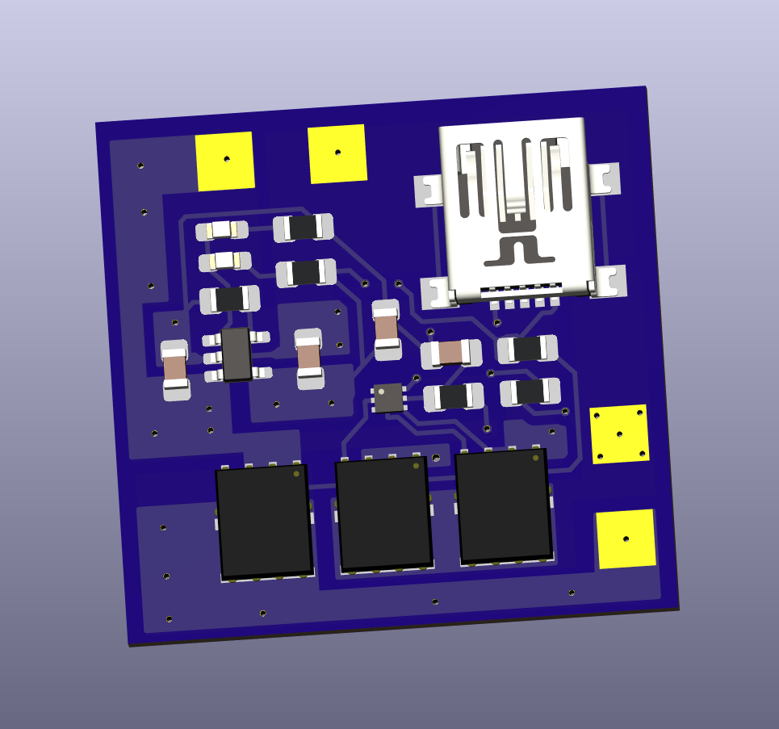

# Li_single_cell_BMS

 -This is a Battery Management System (BMS) for a single cell Li-ion or Li-Po battery. I am currently on version 1 of this design, the PCB has been ordered along with the parts and I will assemble and test it when everything arrives.

-I will be adding a BOM for this build, along with a breakdown of the price per component and the total cost to manufactur each board.

-I will also be performing thorough tests on the board to verify its functionilty and I will record the results to upload them. To accompany the tests, I am aiming to complete a Worst Case Circuit Analysis (WCCA) of my design BEFORE I assemble and test. This will help me with determining the expected operating region for each part to ensure I meet my requirments, and to ensure I am within the manufacturers limits.

**A relatively minor mistake was made on the schematic side, which translated into a larger mistake on the PCB.... I will post the updated schematic, maybe you can spot the difference? Anyways, the error would make the charge over current part of the circuit usless, which is was already because the limit is set to over 2.5A, and my charge IC can only do 0.5A. Either way, it is still a mistake, so I am going to fix it in the CAD software and either order another set of PCBs, or mod the ones I already ordered....TBD.**
# Tests to perform:
- [ ] Verify discharge overcurrent and short circuit functionality (Based off N-channel MOSFETs Rds-ON)
- [ ] Test P-channel MOSFET load switch when 5V is applied
- [ ] Verify charge current (Based off resistor choice)
- [ ] verify UVP & OVP charge parameters of charger IC (Based off individual IC)
- [ ] Test charge overcurrent value (The battery should never reach this charge current based on IC choice, use lab PSU)
- [ ] Verify  OVP & UVP parameters of protection IC (Based off individual IC)
# Version 1 Features:
- 0-500 mA charging rate
- Over voltage charge protection 
- Under voltage discharge protection 
- Over current discharge protection 
- Over current charge protection
- Short circuit protection
- Load disconnects when charging
- Charging and fully charged LED status indicator
- USB mini B receptacle for charging

# Improvements to be made:
- [ ] 5V / 3.3V output rails

