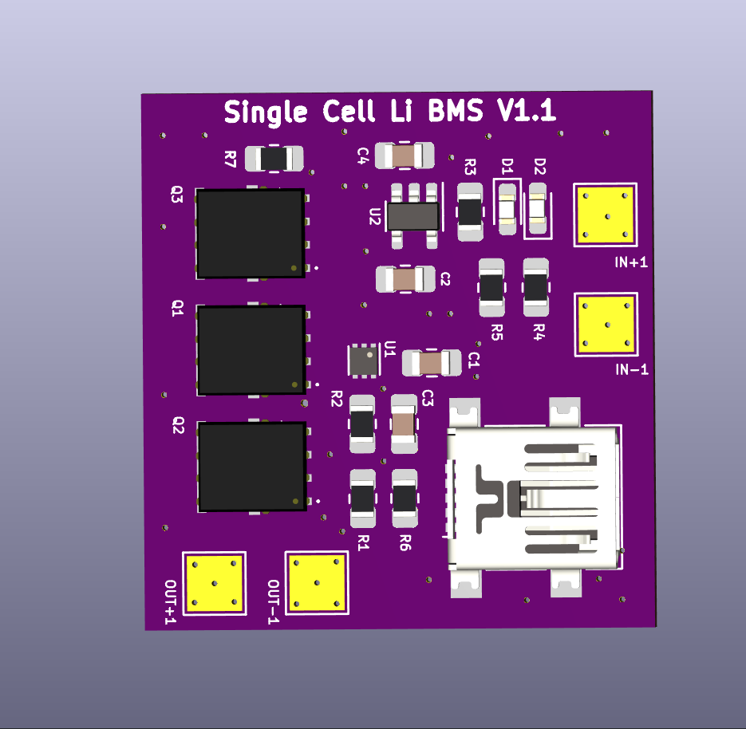

# Li_single_cell_BMS

 -This is a Battery Management System (BMS) for a single cell Li-ion or Li-Po battery. I am currently on version 1 of this design, the PCB has been ordered along with the parts and I will assemble and test it when everything arrives.

-I will be adding a BOM for this build, along with a breakdown of the price per component and the total cost to manufactur each board.

-I will also be performing thorough tests on the board to verify its functionilty and I will record the results to upload them. To accompany the tests, I am aiming to complete a Worst Case Circuit Analysis (WCCA) of my design BEFORE I assemble and test. This will help me with determining the expected operating region for each part to ensure I meet my requirments, and to ensure I am within the manufacturers limits.

# Tests to perform:
- [ ] Verify discharge overcurrent and short circuit functionality (Based off N-channel MOSFETs Rds-ON)
- [ ] Test P-channel MOSFET load switch when 5V is applied
- [ ] Verify charge current (Based off resistor choice)
- [ ] verify UVP & OVP charge parameters of charger IC (Based off individual IC)
- [ ] Test charge overcurrent value (The battery should never reach this charge current based on IC choice, use lab PSU)
- [ ] Verify  OVP & UVP parameters of protection IC (Based off individual IC)
# Features of Version 1:
- 0-500 mA charging rate
- Over charge protection 
- Over discharge protection 
- Over current discharge protection 
- Short circuit protection
- Load disconnects when plugged in to charge
- Charging and fully charged LED status indicator

# Improvements for version 2:
- [ ] Re-arange the reference designators on the PCB silkscreen